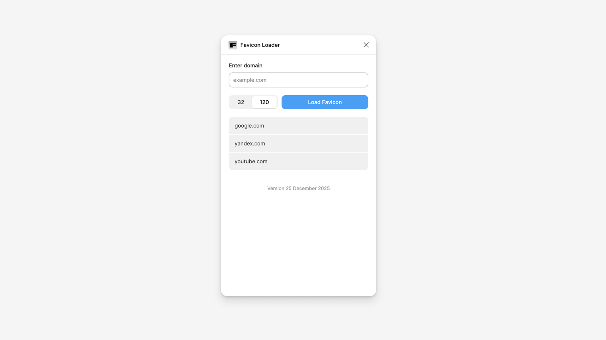

# Favicon Grabber

A simple Figma plugin that lets you quickly grab favicons from any domain and add them to your design.

## Features

- Fetch favicons from any domain with a single click
- Automatically creates a 32×32 image node in your Figma canvas
- Uses reliable Yandex Favicon API
- Clean, minimal interface
- Smart positioning at viewport center

## Installation

1. Clone this repository or download the files
2. Open Figma Desktop App
3. Go to **Plugins** → **Development** → **Import plugin from manifest**
4. Select the `manifest.json` file from this project
5. The plugin is now ready to use!

## Usage

1. Open the plugin from **Plugins** → **Development** → **Favicon Grabber**
2. Enter a domain name (e.g., `github.com` or `figma.com`)
3. Click **Grab Favicon**
4. The favicon will be added to your canvas as a 32×32 image

## How It Works

The plugin fetches favicons using the [Yandex Favicon API](https://favicon.yandex.net/), which provides reliable, high-quality favicons for virtually any domain. The fetched image is automatically converted to a Figma image node and placed in your current viewport.

## License

MIT

---

Built with the Figma Plugin API
