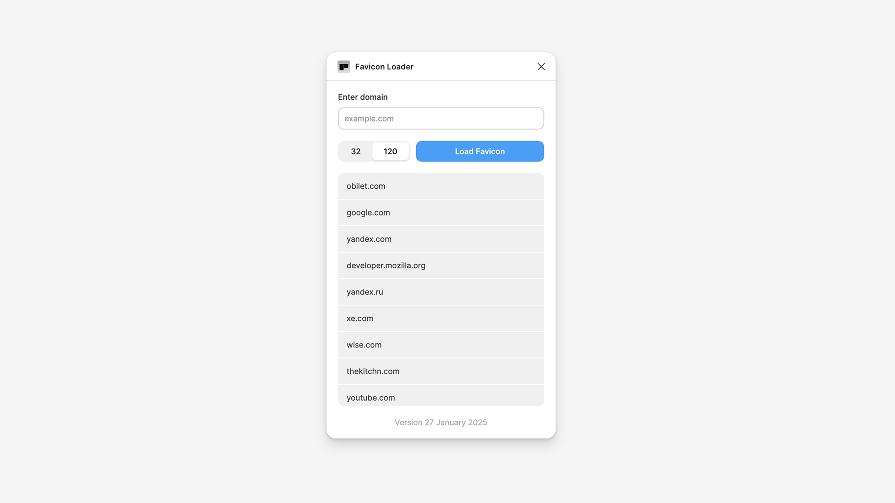

# Favicon Loader

A Figma plugin that loads favicons from any domain and applies them to selected elements.

## Features

- Load favicons from any domain as image fills
- Configurable size (32px or 120px)
- Optional: Replace all fills or add black overlay
- Domain history (up to 100 items)
- Uses Yandex Favicon API

## Installation

1. Open Figma Desktop App
2. **Plugins** → **Development** → **Import plugin from manifest**
3. Select `manifest.json` from this project

## Usage

1. Select an element in Figma
2. Open the plugin
3. Enter a domain (e.g., `github.com`)
4. Click **Load favicon**

Configure options via "Change settings" link.

## License

MIT
